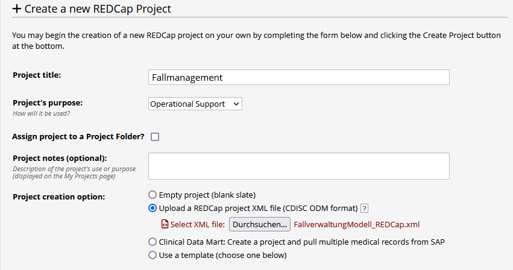
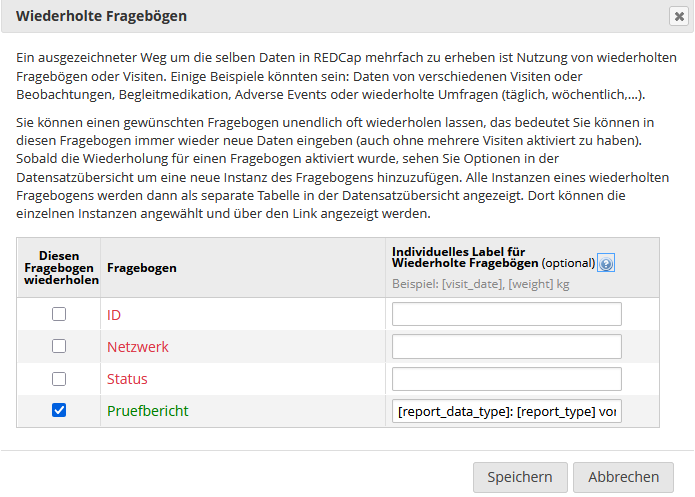

# Fallmanagement Modellvorhaben Genomsequenzierung (MV GenomSeq) nach § 64e SGB V

Beispielprojekt zum Fallmanagement in REDCap als Vorlage zur Anpassung an lokale Gegebenheiten. 

## Installation
- Voraussetzung ist eine REDCap Installation. Eine REDCap-Lizenz kann hier beantragt werden: https://projectredcap.org/partners/join/.
- Das Beispielprojekt inklusive notwendiger Einstellungen kann von einem REDCap Administrator mit der [CDISC ODM XML-Vorlage](FallverwaltungModell_REDCap.xml) erstellt werden:

- Alternativ kann ein leeres Projekt erstellt werden und dort die Datenstruktur mit der [CSV Datei](FallverwaltungModellvorhaben_DataDictionary.csv) importiert werden (Strichpunkt als Separator).

Die Projekteinstellungen müssen dann allerdings manuell vorgenommen werden, v.a. die Einstellungen zu den wiederholten Fragebögen:

Zur einfacheren Bedienung werden externe Module eingesetzt (optional). Falls gewünscht, müssen diese von einem REDCap Administrator im Kontrollzentrum installiert und im Projekt aktiviert werden:
- Auto Populate Fields: Unterdrückung der Fehlermeldung für versteckte Vorgabe-Werte (@DEFAULT "Version der Teilnahmeerklärung")
- Instance Select: Auswahl einer Fallnummer für Datenupload
- Instance Table: Eingabe mehrerer Fallnummern pro Patient
- Orca Search Module: Suchmaske für verschiedene Felder. ([ZIP Datei zum Import der Einstellungen](FallverwaltungModellvorhaben_ModuleSettingsExport.zip))
- Ansicht der im Projekt aktivierten Module: 

## Übersicht über die Datenstruktur
- [PDF Datei](Fallverwaltung_Modellvorhaben_Genomsequenzierung_REDCap.pdf)
  
## Anmerkungen zur Datenstruktur:
- Die Fragebögen "Prüfbericht" und "Fallnummer" sind als wiederholte Fragebögen definiert, da diese beliebig oft eingegeben werden können
- Feld [network]: Auflistung der internen Bezeichnungen der Register, bitte anpassen!
- Feld [network_title]: Ausgabe der Bezeichnungen der Register, bitte anpassen!
- Feld [department]: Interne Abteilungskürzel, bitte anpassen!  

